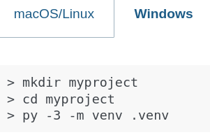
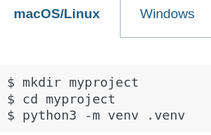
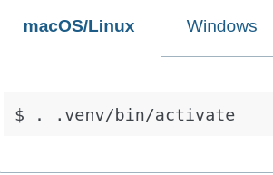
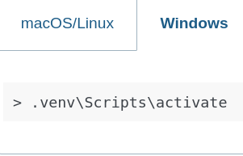

## Week 46

## SQL

```sql 
CREATE SCHEMA IF NOT EXISTS oliver_db;
USE oliver_db;

DROP TABLE IF EXISTS products;

CREATE TABLE products (
                          id INT AUTO_INCREMENT PRIMARY KEY,
                          name VARCHAR(255)
);

INSERT INTO products (name) VALUES
                                ('Apple'),
                                ('Banana'),
                                ('Orange'),
                                ('Grapes'),
                                ('Mango');

```

##  sql connector
current dir
|
|--db
|  |- __init__.py
|  |- connector.py
|
|-- 1_select.py

```python
import mysql.connector
from mysql.connector import Error

def get_connection():
    """Create and return your MySQL connection."""
    try:
        connection = mysql.connector.connect(
            host="localhost",
            user="root",
            password="gokstad",
            database="oliver_db",
            charset = 'utf8'
        )

        if connection.is_connected():
            print("Connected to MySQL")
            return connection

    except Error as e:
        print(f"MySQL connection error: {e}")
        return None

```

```python

from db.connector import get_connection

def main():
    connection = get_connection()

    if not connection:
        print("Cannot continue without a database connection.")
        return

    try:
        # Use dictionary=True for readable output
        with connection.cursor(dictionary=True) as cursor:
            cursor.execute("SELECT * FROM products;")
            results = cursor.fetchall()

            if results:
                print("Products found:")
                for row in results:
                    print(row)  # e.g., {'id': 1, 'name': 'Shoes', 'price': 99.99}
            else:
                print("No products found in the table.")

    except Exception as e:
        print(f"Query error: {e}")

    finally:
        connection.close()
        print("Connection closed")

if __name__ == "__main__":
    main()

```


Task 1: Insert a single product

Write a Python function insert_product(name) that inserts one product into the products table.

Requirements:
1. Get a database connection using get_connection()
2. Create a cursor and write an INSERT query: "INSERT INTO products (name) VALUES (%s)"
3. Execute the query: cursor.execute(query, (name,))
   - Note: (name,) is a tuple — the comma is required!
4. Commit the changes: connection.commit()
5. Use try/except/finally to handle errors and close the connection
   - In except: use connection.rollback() to undo changes
   - In finally: close the connection

Example usage:
    insert_product("Pineapple")

Expected output:
    Product 'Pineapple' inserted successfully with ID: 6
    Connection closed

Hint: Use cursor.lastrowid to get the auto-generated ID after inserting.

Task 2: Insert several products
Write a Python function that inserts several products at once.

Example list: ["Kiwi", "Peach", "Strawberry"].

Use a loop or executemany to insert them.

Print a message for each product added.


## Flask

### Creating a virtual environment for python:

```bash
mkdir week46
cd week 46
```

Windows:  
  
Mac and linux:  


then activate:

Linux and mac:


Windows:  


Then install flask:

```bash
pip install Flask
```

## Old syntax of running a simple webserver:

```python
from flask import Flask

app = Flask(__name__)


@app.route('/')
def hello_world():
    """
    returns a short message on "localhost/"
    """
    return " hello Worlds! "


if __name__ == "__main__":
    app.run(debug=True)
```

Then:

```bash
py hello_world.py
```

## New syntax as of flask 2.2:

```python
from flask import Flask

app = Flask(__name__)


@app.route('/')
def hello_world():
    """
    returns a short message on "localhost/"
    """
    return " hello Worlds! "

```

Then:

```bash
flask --app app --debug run
```

my notes:

fix connection error docker with mysql
start docker container
docker exec -it ga-mysql-2025 mysql -u root -p
gokstad
